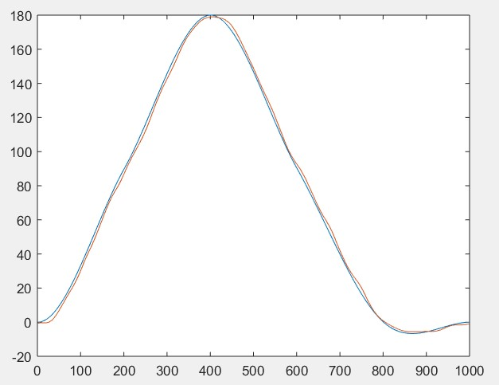

# Motor Control Project
This project was part of Northwestern's Basic Mechatronics (ME333) course.

### Author: Anuj Karnik.

### Overview:
This project dealt with creating a smart motor controller. 
The user was able to communicate with the system via a simple GUI on MATLAB. 
The motor controller could be tasked to work in position or velocity control mode. 
It could even execute step or cubic trajectories depending on the user's choise. 

### Hardware:
1. NU32 development board with a PIC32MX795F512H microcontroller.
2. A generic brushed DC motor with an incremental encoder.
3. A MAX9918 current sensing amplifier.
4. A DRV8835 H-bridge.
5. n-Scope signal analyser.

### System Architecture:
The high-level system architecture can be seen in the diagram below:
.

### File Structure Details:
├── adc.c --> functions related to Analog to Digital conversion.  
├── adc.h 
├── client.m --> client file to run on MATLAB. 
├── currentcontrol.c --> current control functions 
├── currentcontrol.h 
├── encoder.c --> functions to read data from the encoder  
├── encoder.h 
├── genRef.m  
├── images 
│   ├── mc3.jpeg 
│   ├── mc4.jpeg 
│   └── mc5.jpeg 
├── main.c --> main function 
├── NU32bootloaded.ld --> bootloader 
├── NU32.c  
├── NU32.h 
├── positioncontrol.c --> functions related to position control mode 
├── positioncontrol.h
├── pwm.c --> functions related to PWM generation 
├── pwm.h 
├── README.md  
├── read_plot_matrix.m 
├── timer.c 
├── timer.h 
├── utilities.c 
└── utilities.h 

### Results:
The results of the step and cubic trajectories are shown below:
.

  
For a more detailed description and some videos, check out my [portfolio](https://sites.google.com/u.northwestern.edu/anuj-karnik/projects/advanced-mechatronics?authuser=0).

